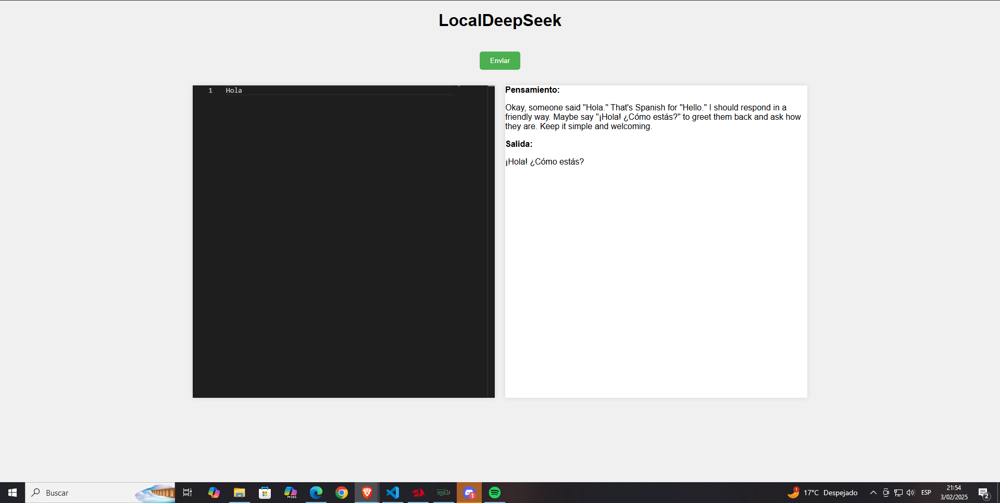

# LocalDeepSeek

LocalDeepSeek es una aplicación que utiliza el modelo de lenguaje DeepSeek para generar respuestas basadas en un prompt proporcionado por el usuario. Esta guía te ayudará a configurar y ejecutar el proyecto en tu máquina local.

##  Requisitos previos
> [!IMPORTANT]
>Antes de comenzar, asegúrate de tener instalados los siguientes requisitos:
>
> [Ollama](https://ollama.com/) (para descargar y ejecutar el modelo DeepSeek)


## Pasos para configurar el proyecto

### 1. Clonar el repositorio

Clona este repositorio en tu máquina local usando el siguiente comando:

```bash
git clone https://github.com/Josue013/LocalDeepSeek.git
cd LocalDeepSeek
```

---

### 2. Instalar el modelo DeepSeek

Asegúrate de descargar el modelo 8b de DeepSeek ejecutando el siguiente comando:

```bash
ollama run deepseek-r1:8b
```
---

### 3. Configurar el servidor

Configura y ejecuta el servidor local para la API de generación de respuestas. Asegúrate de que el servidor esté escuchando en el puerto `11434`.

---

### 4. Ejecutar la aplicación

Abre el archivo [index.html](/index.html) en tu navegador web para interactuar con la aplicación LocalDeepSeek.


---

## Uso

1. Escribe tu prompt en el editor de Monaco.
2. Haz clic en el botón "Enviar".
3. Observa la respuesta generada en la sección de salida.



